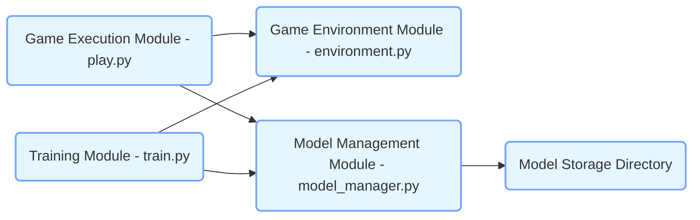
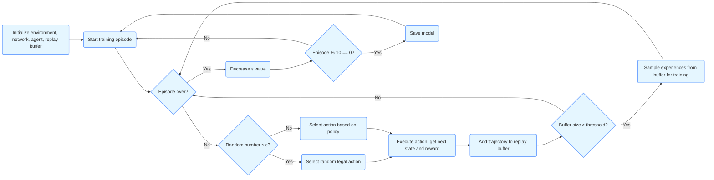
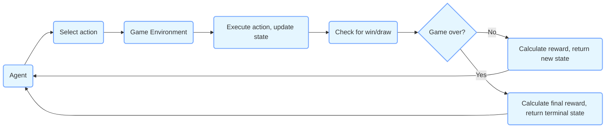
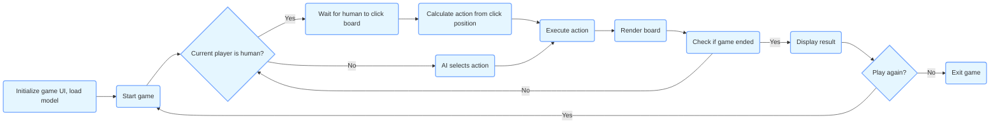

### 1. Architecture Diagram

**Explanation**：
-   The Game Execution Module (play.py) provides a graphical interface for players to interact with the trained AI agent. It relies on the Game Environment Module to obtain game states and execute actions, while using the Model Management Module to load the latest models.

-   The Training Module (train.py) is responsible for training the AI agent. It also depends on the Game Environment Module for agent-environment interactions and uses the Model Management Module to save trained models.

-   The Model Management Module (model_manager.py) handles model saving, archiving, and loading operations, storing models in a designated directory.

### 2. Training Flowchart

**Explanation**：
-   Training begins by initializing the environment, network model, agent, and experience replay buffer.

-   In each training episode, actions are selected based on an ε-greedy policy. If a random number is ≤ ε, a random legal action is chosen; otherwise, the current policy determines the action.

-   After executing the action, the next state and reward are obtained, and the interaction trajectory is added to the replay buffer.

-   If the buffer size exceeds a threshold, a batch of experiences is sampled for training.

-   At the end of each episode, ε is decreased to transition the agent from exploration to exploitation.

-   Models are saved every 10 episodes.

### 3. Environment Interaction Diagram

**Explanation**：
-   The agent selects an action based on the current environment state.

-   The game environment executes the action and updates its state.

-   The environment checks for win/draw conditions.

-   If the game continues, rewards are calculated and the new state is returned; if the game ends, final rewards and a terminal state are returned.

### 4. Game Execution Flowchart

**Explanation**：
-   The game initializes the UI and loads the latest model.

-   Depending on the current player, it either waits for human input or lets the AI select an action.

-   After executing the action, the board is re-rendered.

-   The game checks for completion; if not ended, play alternates between players.

-   Results are displayed upon completion, and players can choose to continue or exit.
